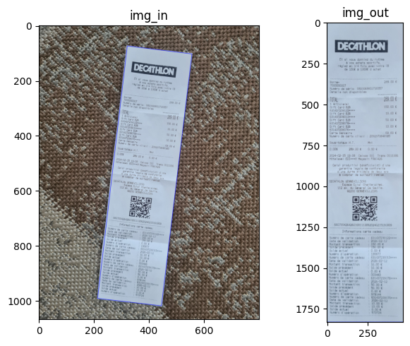

# Receipt Segmentation
We delve into the intricate process of segmenting receipts within images, a crucial step towards enhancing the efficiency and accuracy of subsequent receipt processing tasks. Receipt segmentation serves as the foundation for various downstream applications, particularly Optical Character Recognition (OCR), by standardizing the input and isolating relevant regions of interest.

"# receipt-segmentation" 
